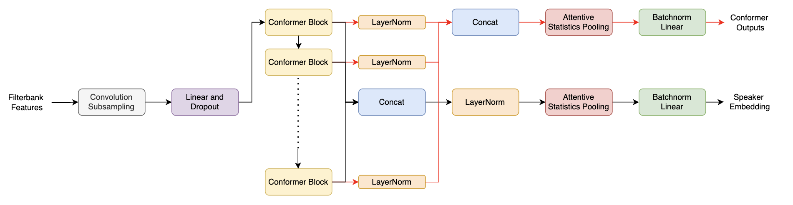

# Contrastive MFA Conformer

This repository is based on [MFA Conformer](https://github.com/zyzisyz/mfa_conformer)

We add auxiliary contrastive losses to the classification loss to improve the speaker verification performance of the MFA conformer. Multiscale Feature Aggregation conformer or MFA conformer is based on the idea of aggregating the conformer block outputs at all the stages (instead of only looking at the final stage output) is important as the low-level feature maps can also contribute towards the accurate speaker embedding extraction. We aim to show that if we ensure that each conformer block learns to separate features, we get improved performance. We do this by introducing contrastive losses to the objective. This results in state-of-the-art performance on the VoxCeleb1 dataset.

<p align="center"></p>

```
pip install -r req.txt 
./data.sh # change path
./data_2.sh # change path
sbatch -p GPU-shared -N 1 --gpus=v100-32:1 --cpus-per-gpu 5 -t 48:00:00 start.sh
```


