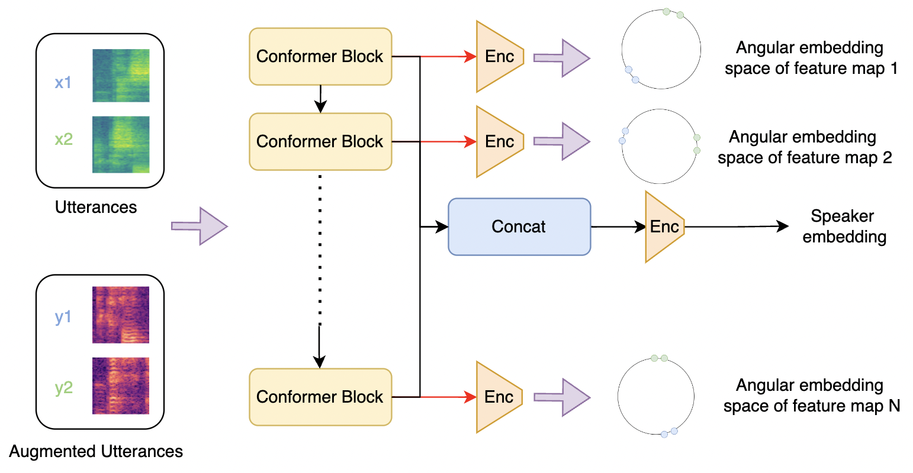
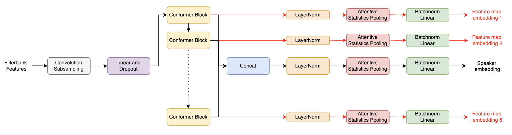

# Contrastive MFA Conformer

This repository is based on [MFA Conformer](https://github.com/zyzisyz/mfa_conformer)

Speaker verification systems have seen significant advancements with the introduction of Multi-scale Feature Aggregation (MFA) architectures, such as MFA-Conformer and ECAPA-TDNN. These models leverage information from various network depths by concatenating intermediate feature maps before the pooling and projection layers, demonstrating that even shallower feature maps encode valuable speaker-specific information. Building upon this foundation, we propose a Multi-scale Feature Contrastive (MFCon) loss that directly enhances the quality of these intermediate representations.
Our MFCon loss applies contrastive learning to all feature maps within the network, encouraging the model to learn more discriminative representations at the intermediate stage itself. By enforcing better feature map learning, we show that the resulting speaker embeddings exhibit increased discriminative power. Our method achieves a 9.05\% improvement in equal error rate (EER) compared to the standard MFA-Conformer on the VoxCeleb-1o test set.

<p align="center"></p>
<p align="center"></p>

```
pip install -r req.txt 
./data.sh # change path
./data_2.sh # change path

sbatch -p GPU-shared -N 1 --gpus=v100-32:1 --cpus-per-gpu 5 -t 48:00:00 start.sh
```


